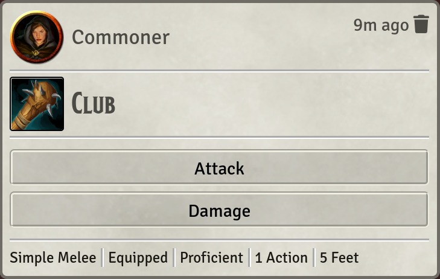

# Simply Portraits

## No-nonsense Chat Portraits for Foundry VTT

There are a couple mods that add chat portraits to chat messages in FVTT.
Typically they come with lots of options. This mod has no options.
Typically chat portrait mods have hundreds or even thousands of lines of code,
and can be hard to fix when they break. This mod has ~50 lines of code and is
trivial to keep up-to-date.

That's it. That's the mod.
